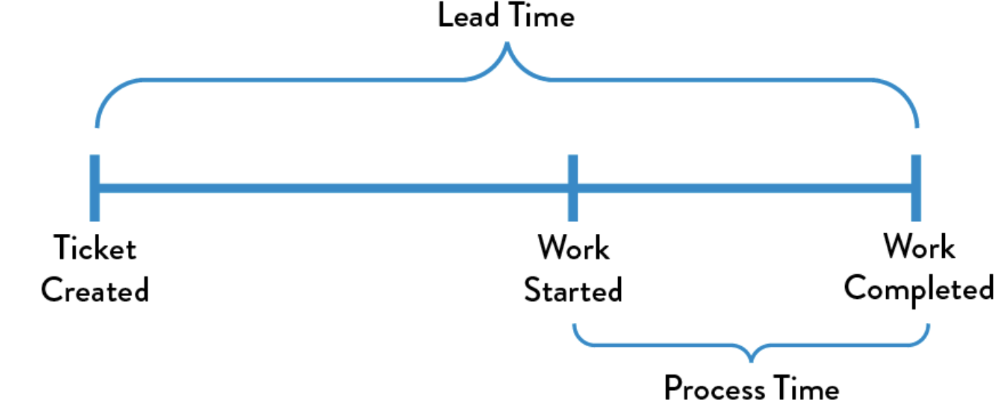
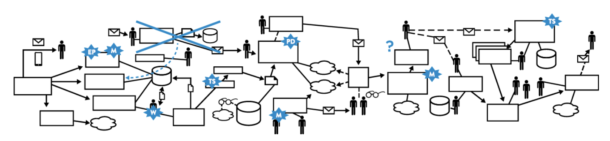
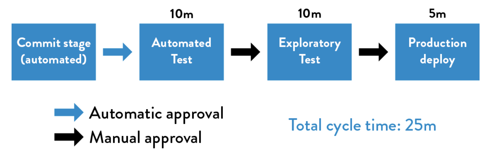
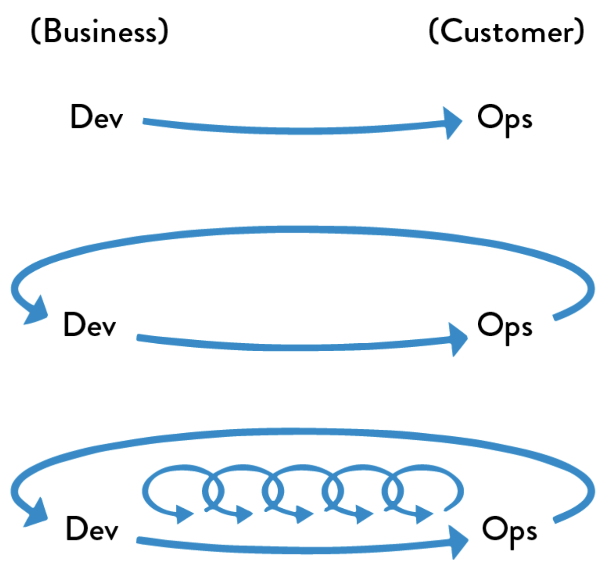

# **Introduction to DevOps**

## **What's DevOps?** 

---

It is the outcome of applying the most trusted principles from the domain of physical manufacturing and leadership to the IT value stream. In other words, applying lean principles to technology value stream and the three ways: Flow, feedback, continual-learning and experimentation.

The result is world-class quality, reliability, stability, and security at ever lower cost and effort; and accelerated flow and reliability throughout the technology value stream, including Product Management, Development, QA, IT Operations, and Infosec.

**Lean principles** Focus on how to create value for the customer through systems thinking by creating constancy of purpose, embracing scientific thinking, creating flow and pull (versus push), assuring quality at the source, leading with humility, and respecting every individual.  

**Flow**  Accelerate the delivery of work from Development → Operations → Customers

**Feedback** Enable us to create ever safer systems of work

**Continual Learning and Experimentation** Promotes a high-trust culture and a scientific approach to organizational improvement risk-taking as part of our daily work

## Lean principles

---

### Value stream

Is the sequence of activities an organization undertakes to deliver upon a customer request. In other words, the sequence of activities required to design, produce, and deliver a good or service to a customer, including the dual flows of information and material.

In manufacturing operations, the value stream is often easy to see and observe: it starts when a customer order is received and the raw materials are released onto the plant floor.

### Technology value stream

In DevOps, we typically define our technology value stream as the process required to convert a business hypothesis into a technology-enabled service that delivers value to the customer. _The input to our process is the formulation of a business objective, concept, idea, or hypothesis, and starts when we accept the work in Development, adding it to our committed backlog of work. From there, Development teams that follow a typical Agile or iterative process will likely transform that idea into user stories and some sort of feature specification, which is then implemented in code into the application or service being built. The code is then checked in to the version control repository, where each change is integrated and tested with the rest of the software system_.

> Because **value is created only when our services are running in production**, we must ensure that we are not only delivering fast flow, but that our deployments can also be performed without causing chaos and disruptions such as service outages, service impairments, or security or compliance failures.

First phase of technology value stream includes **Design and Development** is akin to **Lean Product Development** and is highly variable and highly uncertain, often requiring high degrees of creativity and work that may never be performed again, resulting in high variability of process times. In contrast, the second phase of work, which includes **Testing and Operations**, is akin to **Lean Manufacturing**. It requires creativity and expertise, and strives to be predictable and mechanistic, with the goal of achieving work outputs with minimized variability.

### Deployment lead time

It is a subset of the value stream described above. ***This value stream begins when any engineer in our value stream (which includes Development, QA, IT Operations, and Infosec) checks a change into version control and ends when that change is successfully running in production***, providing value to the customer and generating useful feedback and telemetry.

Instead of large batches of work being processed sequentially through the design/development value stream and then through the test/operations value stream (such as when we have a large batch waterfall process or long-lived feature branches), our goal is to have testing and operations happening simultaneously with design/development, enabling fast flow and high quality. _This method succeeds when we work in small batches and build quality into every part of our value stream_.

#### Lead Time vs. Processing Time

Because lead time is what the customer experiences, we typically focus our process improvement attention there instead of on process time.

#### Deployment lead times requiring months

This is especially common in large, complex organizations that are working with tightly-coupled, monolithic applications, often with scarce integration test environments, long test and production environment lead times, high reliance on manual testing, and multiple required approval processes.

#### Deployment lead times of minutes

In this scenario developers receive fast, constant feedback on their work, which enables them to quickly and independently implement, integrate, and validate their code, and have the code deployed into the production environment (either by deploying the code themselves or by others). 

***We achieve this by continually checking small code changes into our version control repository, performing automated and exploratory testing against it, and deploying it into production***. This enables us to have a high degree of confidence that our changes will operate as designed in production and that any problems can be quickly detected and corrected.

#### %C/A (percent complete and accurate)

This is the third key metric in the technology value stream, it reflects the quality of the output of each step in our value stream and can be obtained by asking downstream customers what percentage of the time they receive work that is ‘usable as is,’ meaning that they can do their work without having to correct the information that was provided, add missing information that should have been supplied, or clarify information that should have and could have been clearer.

### Three ways: The principles underpinning devops (*The Phoenix Project*)

**The First Way** enables fast left-to-right flow of work from Development to Operations to the customer

**The Second Way** enables the fast and constant flow of feedback from right to left at all stages of our value stream. It requires that we amplify feedback to prevent problems from happening again, or enable faster detection and recovery. By doing this, we create quality at the source and generate or embed knowledge where it is needed—this allows us to create ever-safer systems of work where problems are found and fixed long before a catastrophic failure occurs.

**The Third Way** enables the creation of a generative, high-trust culture that supports a dynamic, disciplined, and scientific approach to experimentation and risk-taking, facilitating the creation of organizational learning, both from our successes and failures. Furthermore, by continually shortening and amplifying our feedback loops, we create ever-safer systems of work and are better able to take risks and perform experiments that help us learn faster than our competition and win in the marketplace.